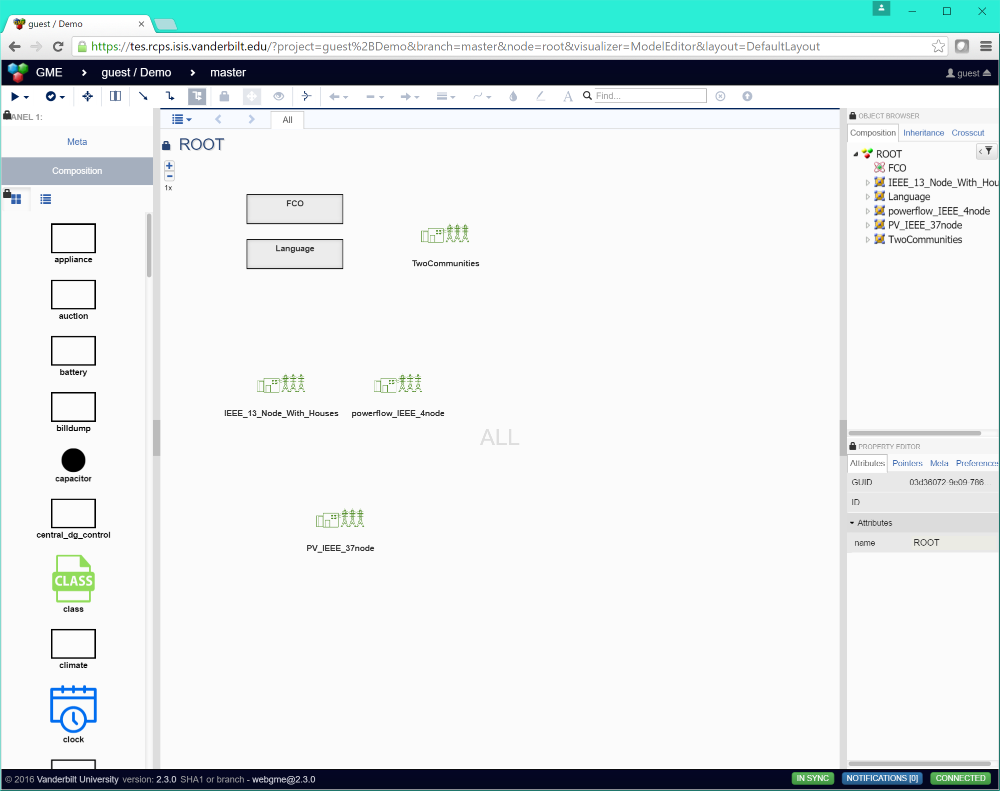
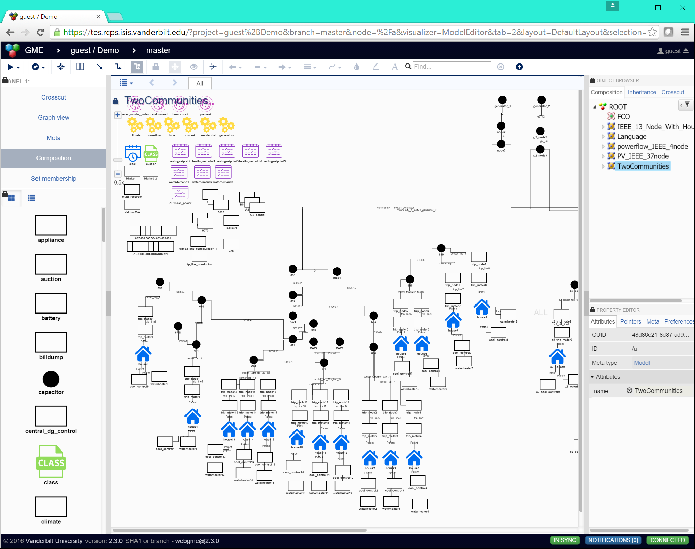

# webgme-gridlabd

Metamodel, visualization, and model generators for gridlab-d in
WebGME.

- [Using Webgme-gridlabd](#using-webgme-gridlabd)
  - [WebGME Interface](#webgme-interface)
  - [META](#meta)
  - [Models](#models)
  - [Plugins](#plugins)
    - [UpdateGLDMeta](#updategldmeta-plugin)
    - [ImportGLM](#importglm-plugin)
    - [GenerateGLM](#generateglm-plugin)
    - [SimulateWithGridlabD](#simulatewithgridlabd-plugin)
    - [SimulateTES](#simulatetes-plugin)
    - [SimulateTESCluster](#simulatetescluster-plugin)
- [Importing a Gridlab-D Model](#importing-a-gridlab-d-model)
- [Creating a Gridlab-D Model from Scratch](#creating-a-gridlab-d-model-from-scratch)
- [Rendering (Serializing) a Gridlab-D Model](#rendering-serializing-a-gridlab-d-model)

## Using webgme-gridlabd

### WebGME interface

The webgme interface allows the visual creation and editing of models,
where the top level (ROOT) of the webgme interface can contain models,
and each model represents a GLM (gridlabd model).



### META

The meta for webgme-gridlabd is broken up into many parts, with the
base meta (GridlabD) being the only hand-crafted part of the meta. The
base meta defines what a model is, what it can contain such as
objects, globals, variables, modules, classes, etc. The types defined
in this aspect are the most basic class definitions from which all
other gridlabd types derive (e.g. a node derives from a powerflow
object which derives from object).


The specific metas for each of the different gridlab-d modules are
defined in their own separate sheets, which are automatically created
when running the UpdateGLDMeta plugin (described below). An example of
an imported meta can be found below (note that when it is imported it
is not automatically laid out, so some manual layout of the objects
may be necessary to better visualize the meta).


### Models

Within a model, you have the ability to create nodes, links between
nodes (e.g. overhead lines, transformers), schedules, loads, etc. just
as you would in a gridlab-d model. Any connection objects between
nodes are visualized as lines connecting those nodes.

Below is a simple 4 node powerflow model which was automatically
imported from a gridlab-d model (GLM) file that exists in the gridlabd
repository.


Below is a more complex example showing two communities of houses
connected to two generators. Each house has water heaters, HVAC
systems, and controllers.



### Plugins

#### UpdateGLDMeta Plugin

The UpdateGLDMeta plugin is useful for automatically updating or
extending the webgme gridlabd meta language with information about the
supported types from the current (or a selected) version of gridlabd. The plugin takes as input a type specification file ([example](./gld_schema/powerflow.cpp)) which can be automatically generated from gridlab-d in the following way:

``` bash
gridlabd --modhelp ${module_name} > ${module_name}.cpp
```

e.g.

``` bash
gridlabd --modhelp powerflow > powerflow.cpp
```

The information about gridlab-d's input arguments and how to run this
command can be found
[here](http://gridlab-d.sourceforge.net/wiki/index.php/Command_options)

When the UpdateGLDMeta plugin runs, it will check to see if the
objects already exist, and if they don't it will create new
meta-objects based on the file specification in a new `MetaAspect`
sheet with the same name as the file. Additionally, if it finds a
loaded svg (i.e. present in the `./src/svgs` folder with the same name
as the meta type it is trying to create, it will automatically assign
that svg to be the icon for that type of object. In this way it is
very easy to create a useful graphical modeling language for gridlab-d
with a minimal amount of effort.

#### ImportGLM Plugin

From the root level, you can run the ImportGLM plugin which takes as
input an uploaded GLM file. The plugin parses this file and creates
webgme objects in accordance with the current webgme meta. This means
that any relevant meta types for that model should be present in the
meta.

#### GenerateGLM Plugin

The GenerateGLM plugin performs the reverse transform of the ImportGLM
plugin, allowing the user to serialize their webgme gridlabd model out
into a simulatable GLM file.

#### SimulateWithGridlabD Plugin

The SimulateWithGridlabD plugin provides the user the ability to
automatically test their gridlabd model. It assumes the user has run
the GenerateGLM plugin on that model on the server previously, and if
so then it executes that model in GridlabD (which must be installed on
the server) and provides the stdout / stderr back to the user for
inspection.

#### SimulateTES Plugin

#### SimulateTESCluster Plugin

## Importing a Gridlab-D Model

## Creating a Gridlab-D Model from Scratch

## Rendering (Serializing) a Gridlab-D Model
