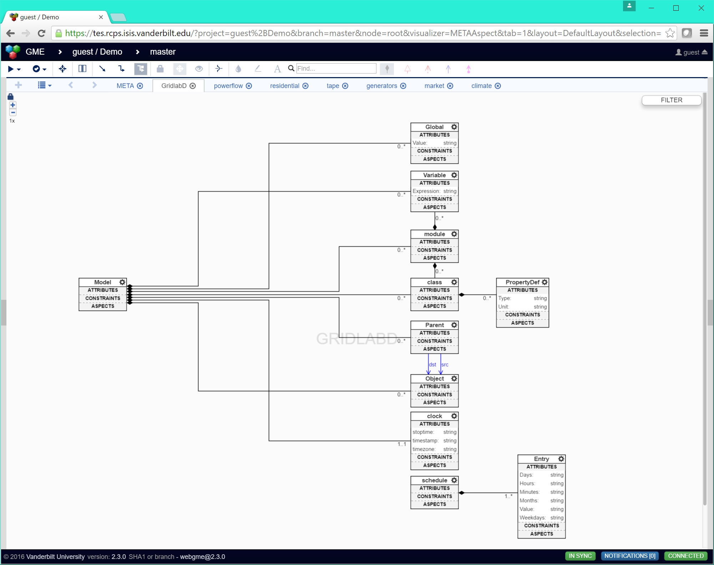
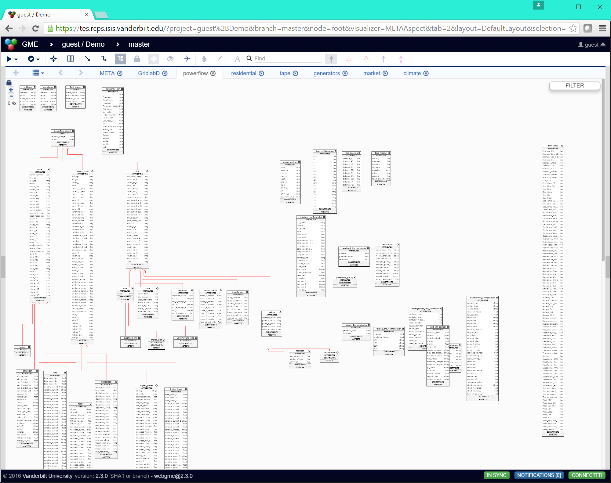

# webgme-gridlabd

Metamodel, visualization, and model generators for gridlab-d in
WebGME.

## Using webgme-gridlabd

### WebGME interface

The webgme interface allows the visual creation and editing of models,
where the top level (ROOT) of the webgme interface can contain models,
and each model represents a GLM (gridlabd model).

### META

### Models

Within a model, you have the ability to create nodes, links between
nodes (e.g. overhead lines, transformers), schedules, loads, etc. just
as you would in a gridlab-d model. Any connection objects between
nodes are visualized as lines connecting those nodes.

### ImportGLM Plugin

### GenerateGLM Plugin

### SimulateWithGridlabD Plugin

### SimulateTES Plugin

### SimulateTESCluster Plugin

### UpdateGLDMeta Plugin
